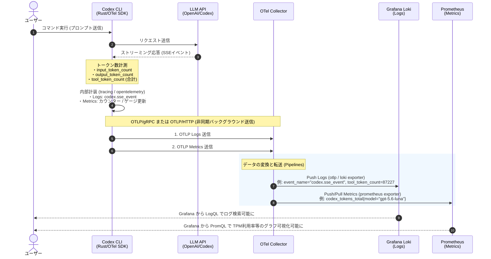

# Codex CLI (Rust) OpenTelemetry (OTel) データフロー仕様書

本書は、Codex CLI (`codex_cli_rs`) において `config.toml` 等で `[otel]` を有効化した際の、データの生成から OpenTelemetry Collector、Loki（ログストレージ）、Prometheus（メトリクスストレージ）までのデータの流れと内部コンポーネントの役割を解説したドキュメントです。

---

## 1. 全体構造とコンポーネント概要

```
[ Codex CLI (Rust) ]
   │
   ├── イベント / トークン数計装 (opentelemetry-rs)
   │
   ├── OTLP/gRPC または OTLP/HTTP プロトコルで送信
   ▼
[ OpenTelemetry Collector ]  (データの中継・変換処理)
   │
   ├── [ Logs Exporter (Loki) ]   ────►  Grafana Loki  ────►  Grafana (ログ検索・分析)
   └── [ Metrics Exporter / Receiver ] ──►  Prometheus    ────►  Grafana (TPM利用率などのダッシュボード)
```

---

## 2. 内部コンポーネントの役割

| コンポーネント | 役割と動作説明 |
| :--- | :--- |
| **Codex CLI (`codex_cli_rs`)** | **データ生成元**。Rust言語で構築されたCLIクライアント。LLM APIとのセッション時（SSEイベント受信、トークン数集計、レスポンス時間計測等）に、内部の計装処理を通じてログおよびメトリクスを自動生成します。 |
| **OpenTelemetry SDK (`opentelemetry-rs`)** | Codex CLI内部に組み込まれているテレメトリライブラリ。生成されたイベントを標準化された **OTLP (OpenTelemetry Protocol)** 形式に変換し、バックグラウンドで非同期送信します。 |
| **OpenTelemetry Collector** | 受け取った OTLP データを集約・整形し、Loki や Prometheus など各バックエンドストレージに適した形式に変換して送信するパイプラインコンポーネントです。 |
| **Grafana Loki** | **構造化ログデータベース**。Codex のイベントログ（`codex.sse_event` や `tool_token_count` 等のフィールドを含むコンテキストデータ）をラベル付きログとして蓄積します。 |
| **Prometheus** | **時系列メトリクスデータベース**。1分あたりの消費トークン数（TPM）やリクエストのレイテンシ、成功/失敗数などの数値指標を時系列で保存・集計します。 |

---

## 3. シーケンス図（データフロー）

以下は、ユーザーのコマンド実行から Loki / Prometheus へのデータ格納・可視化までの処理フローを示すシーケンス図です。



---

## 4. 各ストレージへ出力される主要データ

### ① Loki (構造化ログ)
* **`event_name`**: `codex.sse_event`
* **`service_name`**: `codex_cli_rs`
* **トークン関連フィールド**:
  * `input_token_count`: 入力プロンプトのトークン数
  * `output_token_count`: 出力レスポンスのトークン数
  * `tool_token_count`: 総消費トークン数 (`input_token_count` + `output_token_count`)
  * `cached_token_count`: キャッシュ適用トークン数
* **メタデータ**: `conversation_id`, `model`, `user_email`, `ttft_ms` など

### ② Prometheus (時系列メトリクス)
* `codex_tokens_total{service_name="codex_cli_rs", model="gpt-5.6-luna", type="input"}`
* `codex_tokens_total{service_name="codex_cli_rs", model="gpt-5.6-luna", type="output"}`
* `codex_request_duration_ms_bucket{...}` (レスポンス速度のヒストグラム)

> **TPM利用率の算出一例 (PromQL)**:
> `sum(rate(codex_tokens_total[1m])) / <上限TPM値> * 100`
