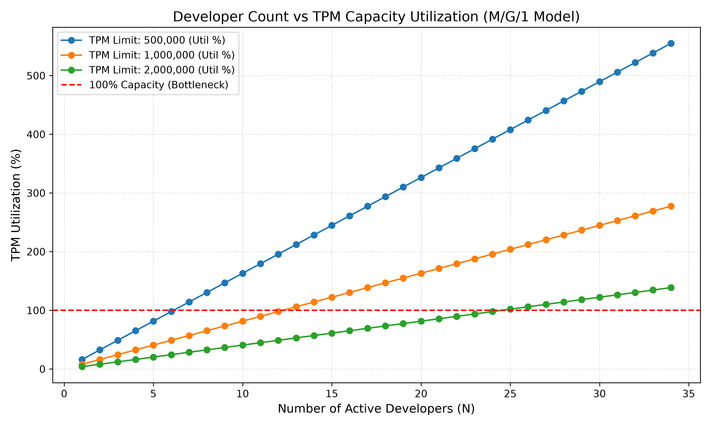

# Codex 利用はパンクするのかしら？
### ログデータと待ち行列理論（$M/G/1$）で解き明かす LLM キャパシティの限界

---

## 1. Executive Summary（結論）

* **課題**
  * チーム内で Codex 利用が増えると、突然 API のレートリミット（`429 Too Many Requests`）が発生する。
* **原因**
  * Codex のログを解析した結果、1回のやり取りの平均トークン数が **約 6.5 万トークン** と超巨大であることが判明。
* **数理モデルでの検証（OR: 待ち行列理論）**
  * 実測データから開発者の行動パターンを抽出し、$M/G/1$ モデルでシミュレーション。
* **結論**
  * 一般的な **50万 TPM 制限の環境では、たった 7 人の同時利用で API がパンク（100%突破）** する。

---

## 2. 背景：Codex 特有のトークン消費構造

* **通常の Chat LLM との違い**
  * 一般的なチャット: 1回あたり数千トークン程度。
  * Codex (TUI / IDE): 会話が長くなると **過去の文脈・関連コード全文を毎リクエスト添付** する。
* **ログデータ（Grafana Loki）の実態**
  * `input_token_count`: **平均 65,316 トークン**（全体の99.5%以上を占める）
  * `output_token_count`: **平均 278 トークン**
  * **合計 (S): 1リクエストあたり平均 約 65,595 トークン**
* 👉 **1回のメッセージ送信自体が、非常に重いネットワーク・帯域負荷になっている！**

---

## 3. 数理モデリング：$M/G/1$ 待ち行列モデルの適用

API の帯域制限（TPM: Tokens Per Minute）を 1 つの「窓口」と見立てて定式化。

* **到着過程 ($M$ - Markovian):**
  * 開発者のリクエスト発生はランダム（**ポアソン過程**）。
  * 実測値: 1人あたり **$\lambda_1 = 1.244 \text{ req/min}$**（約 48 秒に 1 回呼び出し）。
* **サービス時間 ($G$ - General):**
  * 1リクエストで消費するトークン量 $S$。
  * 実測値: 平均 $E[S] = 65,595$ トークン / 分散 $Var[S] = 146.5 \times 10^6$。
* **窓口 ($1$):**
  * API 全体の処理容量制限上限 ($TPM_{Limit}$)。

---

## 4. シミュレーション結果：同時利用人数 vs TPM 利用率

* **TPM 制限 50 万（青線）**
  * **限界値: 6 人**
  * 7 人で利用率 114.2% となりパンク。
* **TPM 制限 100 万（黄線）**
  * **限界値: 12 人**
* **TPM 制限 200 万（緑線）**
  * **限界値: 24 人**

---

## 5. ボトルネックの構造解剖

なぜこれほど少ない人数でパンクしてしまうのか？

1. **高密度な要求レート**
   * 開発者 1 人あたり、1 分間に約 **8.1 万トークン** の帯域を要求している。
2. **分散（ばらつき）の影響**
   * コンテキスト長は 3.8 万 〜 8.7 万トークンまで大きく変動する。
   * $M/G/1$ モデルの特性上、消費量のばらつき（$C_v^2$）が大きいほど、瞬間的な待ち時間・帯域溢れが発生しやすくなる。

---

## 6. OR的アプローチによる改善ソリューション案

精神論（「節約しよう」）ではなく、**構造的（システム・運用）な解決** を提案。

### ① サービス時間 $E[S]$ の縮小（システム改善）
* **コンテキスト要約 / Sliding Window の導入**
  * 過去履歴を圧縮し、1リクエストの平均トークン数を 6.5 万 ➔ **3 万** に削れば、同じ TPM 制限のまま**収容人数を 2 倍（12人）に拡張可能**。

### ② 到着率 $\lambda$ の平準化（運用・自動化改善）
* **バックグラウンド処理の分散**
  * 自動テストや CI/CD からの大量リクエストを夜間にシフトし、日中の人間の作業帯域を確保。

---

## 7. まとめと今後の展望

* **本研究の成果**
  * Grafana Loki の可観測性ログから、$M/G/1$ 待ち行列モデルを構築。
  * 「チームで何人 Codex を使うとパンクするか」を定量的（数学的）に可視化した。
* **今後のアクション**
  1. システムプロンプト・履歴送信ロジックの最適化によるトークン削減の検証。
  2. 組織規模に応じた適切な API Tier（TPM 枠）の選定指標としての活用。

---

# Thank you!
### Questions & Discussion
